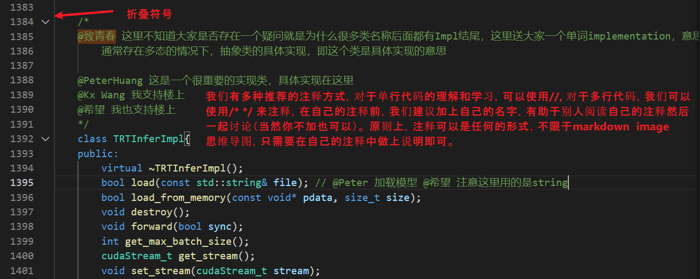
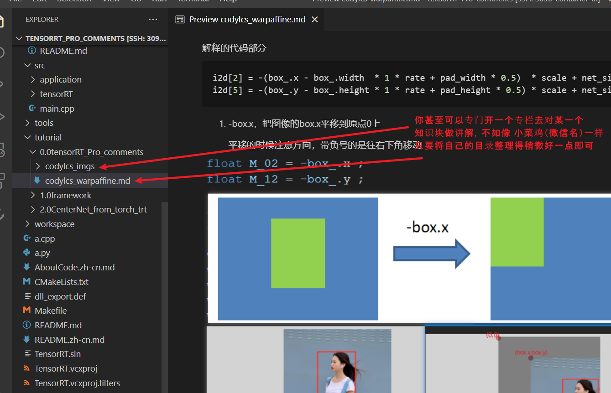
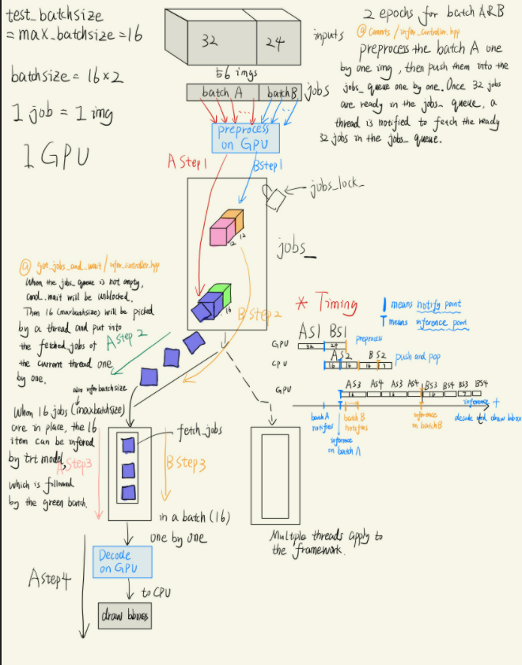

# tensorRT_Pro_comments
你好呀！

@Peter
    hello world!!!!
"""
  @ zhao : 大家好！
"""
@Lacacy
   晚上好，各位，准备洗洗睡了！
"""

@codylcs
   这是一个测试
"""
tensorRT_Pro:
https://github.com/shouxieai/tensorRT_Pro

:fire: :fire: :sparkles: 想要加入的赶紧在群上发出来自己的github账号/邮箱吧！！！ :sparkles: :zap: :zap:  
各位小伙伴们将会成为contributor一起共建更好用的部署工具库

本仓库建立的主要目的是希望能够帮助大家更好地学习使用tensorRT_Pro,为此我们希望集结大家的力量一起去将平时自己写的comments也能按着自己习惯git push上来。

我们将采用最简单易行的方式鼓励大家参与建设与共赢，任何人都可以成为本项目的contributor. 参与方式如下

- 联系deeppeter(微信号 peterdeep)，成为contributor
- git clone 下 tensorRT_Pro_comments
- 按着自己本身的工作方式，在你理解和学习代码的时候添加注释，再git push回去

## 例子
注释的形式任由各位发挥！！最简单的一句话就是为了让大家不专门花费精力做这件事情，我们注释的方法优先考虑自己即可，但是我们尽量避免改变希望的源码。这份代码也会与tensorRT_Pro官方repo保持同步更新。

    

   

    

   

    

## 目前已有的comments
- 以下名字为微信名称
- tutorial/1.0 2.0(框架性解读) by deeppeter and  0.0 by 小菜鸡
- simple_yolo by 致青春
- src/tensorRT/common/monopoly_allocator.hpp by 没有昵称

## 注意事项：
@peterhuang 
- 我特别爱中国

@daslkfj
// 锄禾日第十个当午
// 汗滴第禾九下个土，
// 谁盘中餐 第七个
// 粒粒皆辛苦
   哈哈哈哈啊哈哈哈哈哈
   第四个
   第五个

