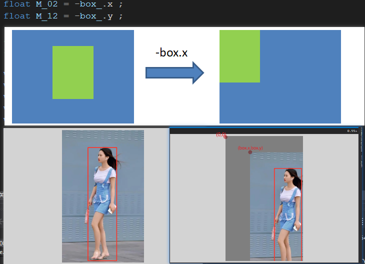
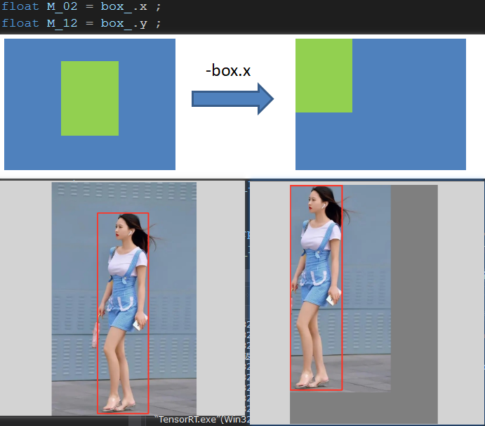
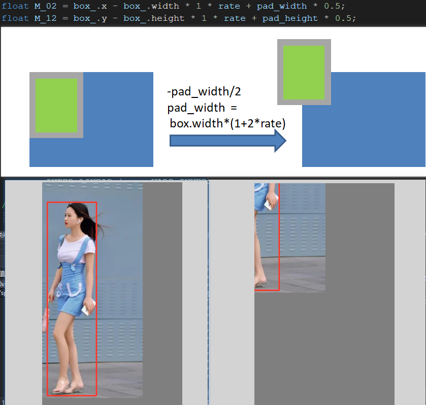
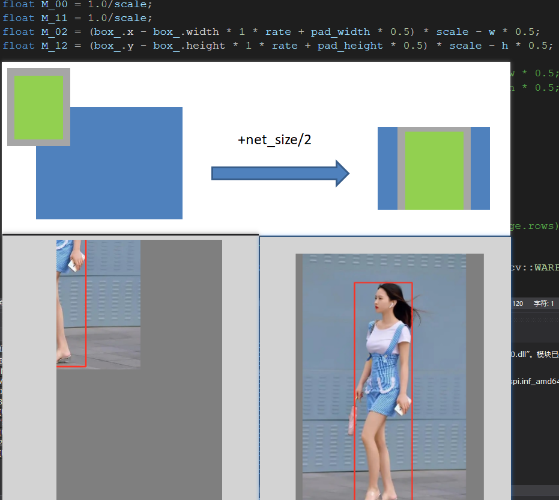

解释的代码部分

```c++
i2d[2] = -(box_.x - box_.width  * 1 * rate + pad_width * 0.5)  * scale + net_size.width  * 0.5;  
i2d[5] = -(box_.y - box_.height * 1 * rate + pad_height * 0.5) * scale + net_size.height * 0.5;
```


1. -box.x，把图像的box.x平移到原点0上

   平移的时候注意方向，带负号的是往右下角移动



移动为正值的时候往左上角进行移动



2. +box.width * 1 * rate，把图像向右平移一点点像素，具体多少呢，需要pad的外围大小的一半。box.width * 2 * rate是pad后的尺寸


3. -pad_width * 0.5，把box的pad后中心平移到原点上

   

4. +net_size.width * 0.5，平移到网络输入的中心上

实现该部分的源码

```c++
Mat image = imread("inference/gril.jpg");
/*
	* auto box = Rect(158, 104, 176, 693);
	* float rate = box_.width > 100 ? 0.1f : 0.15f;
            float pad_width  = box_.width  * (1 + 2 * rate);
            float pad_height = box_.height * (1 + 1 * rate);
            float scale = min(net_size.width  / pad_width,  net_size.height / pad_height);
            i2d[0] = scale;  i2d[1] = 0;      i2d[2] = -(box_.x - box_.width  * 1 * rate + pad_width * 0.5)  * scale + net_size.width  * 0.5;  
            i2d[3] = 0;      i2d[4] = scale;  i2d[5] = -(box_.y - box_.height * 1 * rate + pad_height * 0.5) * scale + net_size.height * 0.5;
*/
	int w = 288;
	int h = 384;

	auto box_ = Rect(158, 104, 176, 693);
	uint8_t r, g, b;
	tie(r, g, b) = iLogger::random_color(0);

	cv::rectangle(
		image,
		cv::Point(box_.x, box_.y),
		cv::Point(box_.x+box_.width, box_.y+box_.height),
		cv::Scalar(b, g, r),
		3
	);

	float rate = box_.width > 100 ? 0.1f : 0.15f;
	float pad_width = box_.width * (1 + 2 * rate);
	float pad_height = box_.height * (1 + 1 * rate);
	float scale = min(w / pad_width, h / pad_height);
	//scale = 1;

	/*double angle = 90;
	int len = std::max(image.cols, image.rows);
	cv::Point2f center(len /2., len /2.);
	cv::Mat rot_mat = cv::getRotationMatrix2D(center, angle, 1.0);
	cv::Mat patch_r;
	cv::warpAffine(image, patch_r, rot_mat, cv::Size(806, 500), cv::INTER_LINEAR | cv::WARP_INVERSE_MAP, cv::BORDER_CONSTANT,
		cv::Scalar(127, 127, 127));*/


	cv::Mat warp_matrix(2, 3, CV_32FC1);
	float M_00 = 1.0/scale;
	float M_11 = 1.0/scale;
	float M_02 = (box_.x - box_.width * 1 * rate + pad_width * 0.5) * scale - w * 0.5;
	float M_12 = (box_.y - box_.height * 1 * rate + pad_height * 0.5) * scale - h * 0.5;

	/*float M_02 = -(box_.x - box_.width * 1 * rate + pad_width * 0.5) * scale + w * 0.5;
	float M_12 = -(box_.y - box_.height * 1 * rate + pad_height * 0.5) * scale + h * 0.5;*/

	warp_matrix.at<float>(0, 0) = M_00;
	warp_matrix.at<float>(0, 1) = 0;
	warp_matrix.at<float>(0, 2) = M_02;
	warp_matrix.at<float>(1, 0) = 0;
	warp_matrix.at<float>(1, 1) = M_11;
	warp_matrix.at<float>(1, 2) = M_12;

	cv::Mat patch;
	/*cv::warpAffine(image, patch, warp_matrix, cv::Size(int(image.cols), int(image.rows)),
		cv::INTER_LINEAR | cv::WARP_INVERSE_MAP, cv::BORDER_CONSTANT,
		cv::Scalar(127,127,127));*/
	cv::warpAffine(image, patch, warp_matrix, cv::Size(w, h), cv::INTER_LINEAR | cv::WARP_INVERSE_MAP, cv::BORDER_CONSTANT,
		cv::Scalar(127, 127, 127));
```

